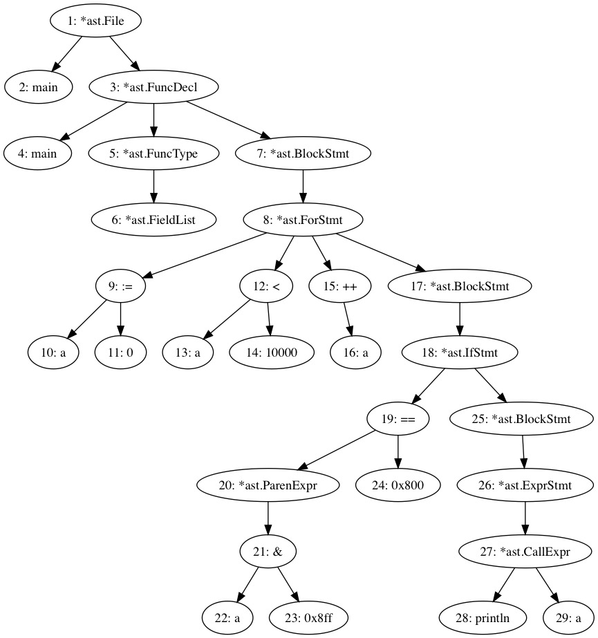

# Go interpreter

A Go interpreter in go

## Tests

Tests are simple standalone go programs to be run by `gi` executable.
Scripts are converted to go test examples for execution by `go test` as well.
To create a new test, simply add a new .gi file, specifying expected output at end of program in a `// Output:` comment block like in the following example:

```go
package main

func main() {
	println("Hello")
}
// Output:
// Hello
```

Then in `_test/`, run `make` to re-generate `interp/eval_test.go`

When developping/debugging, I'm running `gi` on a single script, using `-a` and `-c` options to display AST and CFG graphs, and instrumenting code with temporary println statements to diagnose problems.

## Status

### To Do
- [ ] goto
- [ ] select
- [ ] type checking
- [ ] type assertions and conversions (in progress)
- [ ] type switch
- [ ] interfaces (in progress)
- [ ] diagnostics and proper error handling
- [ ] named output variables (test/ret1.gi)
- [ ] defer
- [ ] ellipsis
- [ ] method calls from runtime to interpreter
- [ ] forward declarations

### Done
- [X] basic literals
- [X] variable definition and assignment
- [X] arithmetic and logical expressions
- [X] if / else statement, including init
- [X] for statement
- [X] go routines
- [X] channels
- [X] variables definition (1 scope per function)
- [X] function definition
- [X] function calls
- [X] methods
- [X] assignements, including to/from multi value
- [X] return, including multiple values
- [X] for range
- [X] arrays
- [X] maps
- [X] &&, ||, break, continue
- [X] switch (partial)
- [X] type declarations
- [X] hierarchical scopes for symbol resolution
- [X] universe (global) scope
- [X] closures
- [X] imports from exec
- [X] imports from source
- [X] init functions
- [X] exports to exec
- [X] pointers, including on struct, method receivers...
- [X] slices / map expressions
- [X] variadic functions
- [X] constants
- [X] iota

## Developpement plan

### Step 1: a symbolic interpreter

The fisrt step consists to create a *symbolic* interpreter, generic, architecture independent, with a minimal execution layer on top of the abstract syntax tree (AST).

The lexical and syntaxic analysis are to be reused from Go toolchain code (up to AST production).

The AST (abstract syntax tree) will be extended to permit in place execution through extending the AST to a control flow graph (CFG), using a technique developped for bip (private project), and allowing high speed interpretation on top of AST.

The result of first step is a fully workable and portable Go interpreter with all features present in the language, but with a limited level of performances.

The starting point is the bip interpreter (Marc's private project) in C, ported to Go.

### Step 2: an optimizing tracing JIT compiler

The second step consists to add a dynamic code generator, thus extending the interperter with a Just-In-Time compiler. 

The dynamic code generator converts parts of the intermediate representation (IR), here a specialy annotated AST, directly to machine code in executable memory pages. It is expected to reuse parts of the Go assembler for the machine code generation).

One idea is to use traces from the interpreter to replace hot paths (i.e. intensive loops) by snippets of stream-lined native code. The code generator doesn't need to be complete to start gaining performance improvemeents, as only parts where code generator is guaranteed to works will be applied, and the symbolic execution level serves as a fallback.

## Design notes

This section documents some design analyses and choices. It is related to symbolic interpretation (step 1) only for now.

### AST Peculiarities

AST is fundamental to code analysis, various compilation steps and interpretation. It is very important to get it right, specially for a dynamic interpreter.

#### Limitations of go/ast

The `go/ast` has been designed and optimized for parsing operations. It relies exclusively on interface methods to perform traversal of the tree (node objects must provide a `visitor` method).

the AST is a tree structure where nodes are objects of different types (type being specialized according to the kind of object: expression, statement list, operator, identificator, etc.).

In this case, traversal can be performed only recursively, less efficiently than an iterative traversal.

In addition, the provided Walk method implements only depth first traversal in pre-order manner (where node callback is called before visiting children nodes), but it is required to process nodes in post-order (node callback called after visiting all children), at least for CFG generation, optimizations at AST level and code generation.

#### Our AST

Our AST is represented with a tree of objects of all the same type Node, each node containing pointers to ancestor and children.

This structure allows a simpler implementation of recursive tree walk, and makes possible an faster and more efficient non-recursive tree walk.

The tree walk allows callback both for pre-order and post-order processing.

## Example

Consider the following source:

```go
package main

func main() {
	for a := 0; a < 10000; a++ {
		if (a & 0x8ff) == 0x800 {
			println(a)
		}
	}
}
```

AST: 

CFG: 

In CFG, the node labels correspond to the number in left of AST nodes
